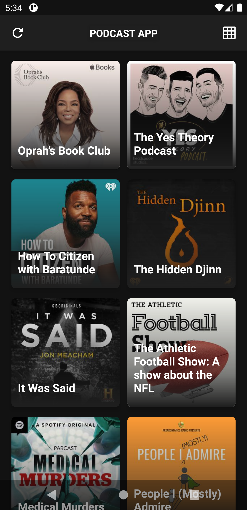
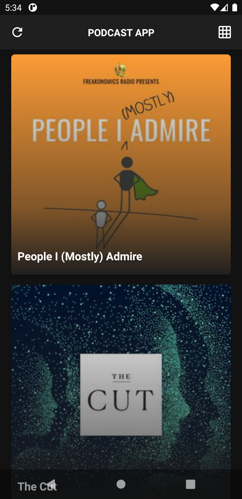
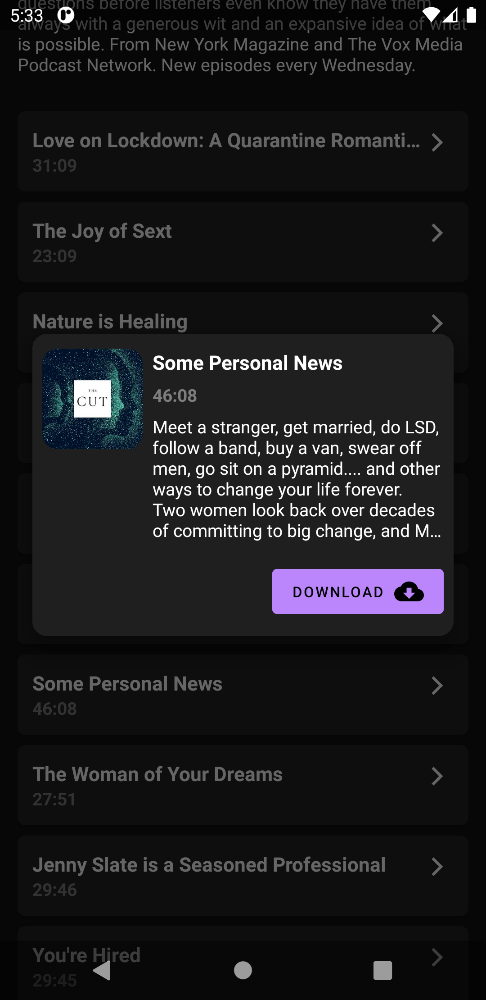
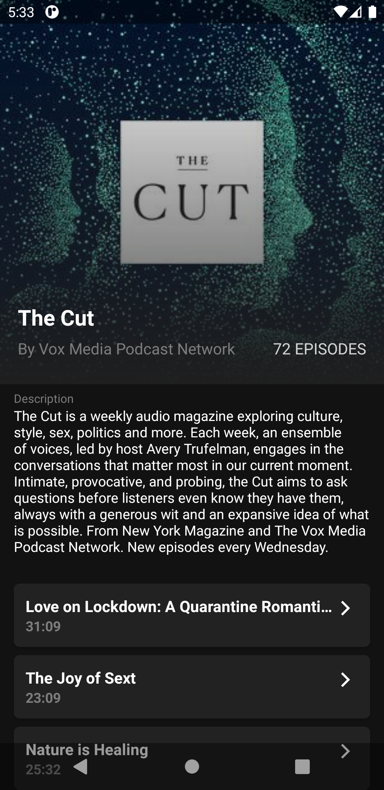

# Podcast App

## Description

A minimal Podcast listening application
that uses the **LISTEN NOTES** api to display the top trending podcasts
and let the user download them straight to their device.

## Preview

## Tasks

- [ ] Enable lazy loading for the list of podcast episodes
